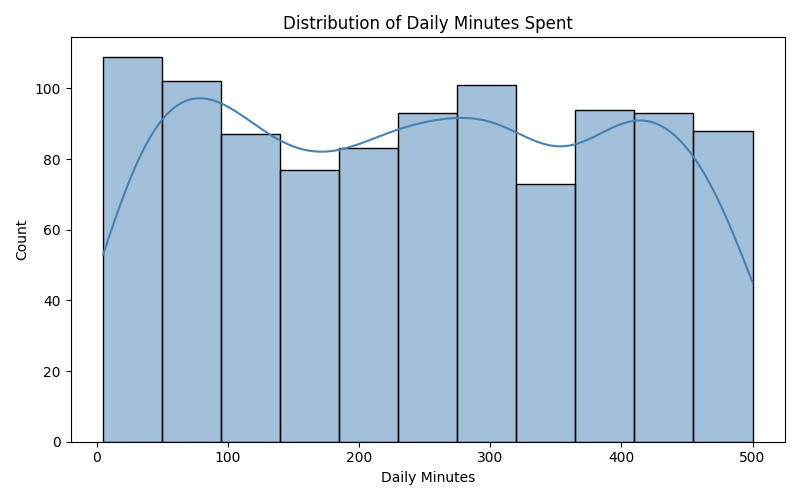
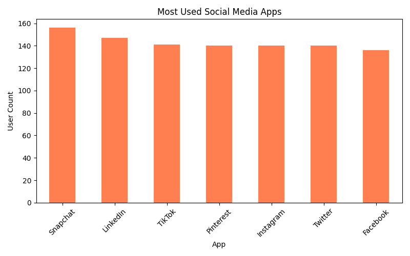
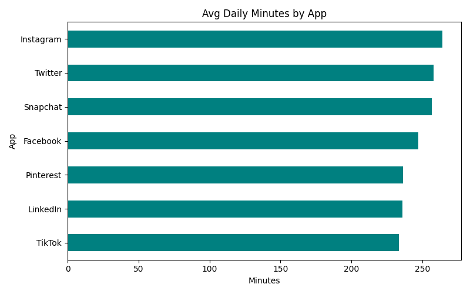
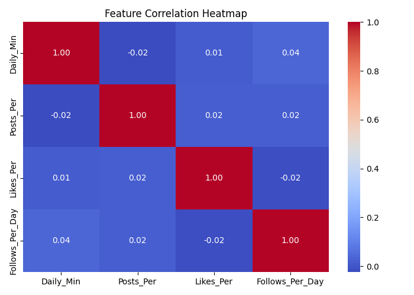
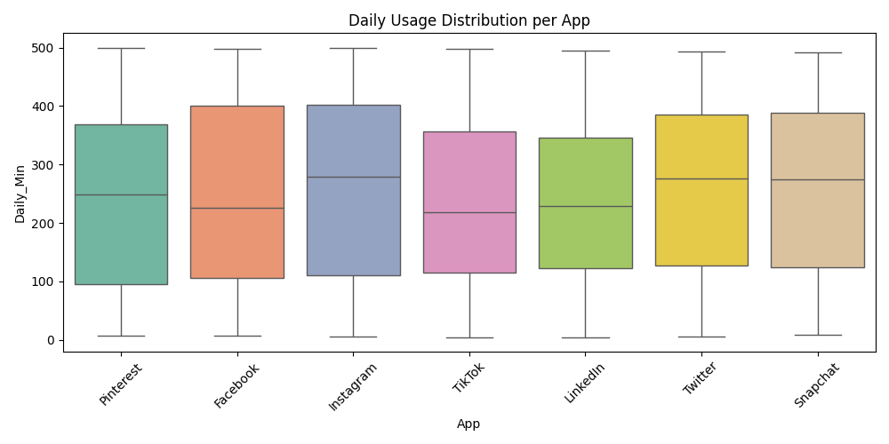
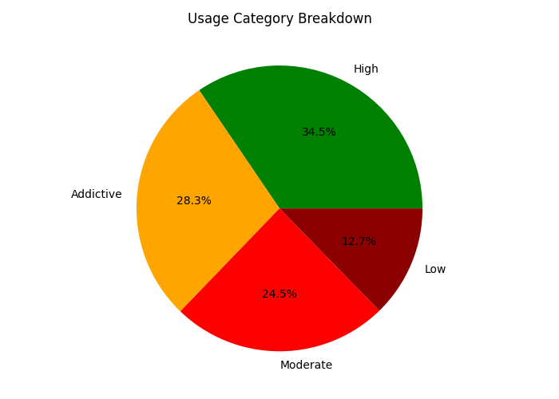
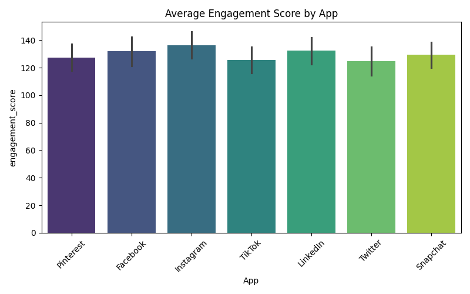

# 📊 Social Media Analytics Dashboard with AIML Chatbot

An interactive Streamlit dashboard for analyzing social media usage patterns with an integrated AIML chatbot assistant.  
The project provides visual insights into screen time, app popularity, engagement trends, and user behavior analytics.

---

# 🚀 Features

- Interactive Streamlit dashboard
- AIML chatbot integration
- Social media usage analytics
- Data visualization using Plotly & Matplotlib
- Correlation analysis
- User engagement analysis
- Dark-themed responsive UI

---

# 🛠️ Technologies Used

- Python
- Streamlit
- Pandas
- Plotly
- Matplotlib
- Seaborn
- AIML

---

# 📁 Project Structure

```bash
SOCIAL_MEDIA_EDA/
│
├── .venv/
├── app.py
├── brain.aiml
├── social_media_usage.csv
├── requirements.txt
├── README.md
│
├── 01_usage_distribution.png
├── 02_app_popularity.png
├── 03_avg_minutes_per_app.png
├── 04_correlation_heatmap.png
├── 05_boxplot_per_app.png
├── 06_usage_category_pie.png
├── 07_engagement_per_app.png
│
├── image(2).png
├── image(3).png
├── image(4).png
```

---

# ⚙️ Installation

Clone the repository:

```bash
git clone https://github.com/Srajnaik/social-media-dashboard.git
```

Move into the project directory:

```bash
cd social-media-dashboard
```

Install dependencies:

```bash
pip install -r requirements.txt
```

Run the Streamlit application:

```bash
streamlit run app.py
```

---

# 🌐 Live Demo

Add your deployed Streamlit link here:

```bash
https://social-media-dashboard-analysis.streamlit.app
```

---

# 📸 Application Screenshots

## Dashboard Overview

.png)

---

## Analytics Visualizations

.png)

---

## AIML Chatbot Interface

.png)

---

# 📊 Data Analysis Visualizations

## 1. Distribution of Daily Minutes Spent

Shows how users spend time daily on social media platforms.



---

## 2. Most Used Social Media Apps

Displays the popularity of different social media platforms.



---

## 3. Average Daily Minutes by App

Compares average screen time across platforms.



---

## 4. Feature Correlation Heatmap

Visualizes correlations between engagement metrics.



---

## 5. Daily Usage Distribution per App

Boxplot representation of user activity spread across apps.



---

## 6. Usage Category Breakdown

Displays user segmentation based on social media usage behavior.



---

## 7. Average Engagement Score by App

Compares engagement levels across social media platforms.



---

# 📈 Key Insights

- Snapchat has the highest user count among platforms.
- Instagram and Twitter show high average daily usage.
- Engagement scores are relatively balanced across apps.
- User behavior varies significantly across platforms.
- Correlation between usage metrics is comparatively low.

---

# 🔮 Future Improvements

- Real-time analytics integration
- NLP-powered chatbot enhancement
- User authentication system
- Database integration
- Docker deployment support

---

# 👩‍💻 Author

**Spurthi Raj**

- GitHub: https://github.com/Srajnaik
- LinkedIn: https://www.linkedin.com/in/s-rajnaik07

---
